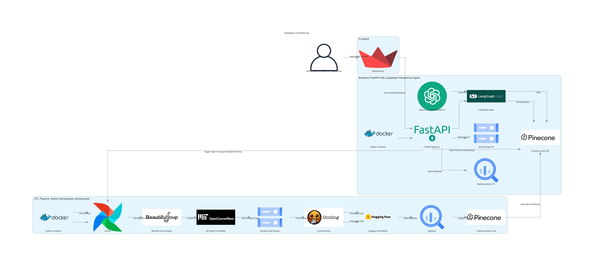

# EduSearch AI: Transforming Course Playlists into Interactive Learning Resources

## Objective
EduSearch AI aims to transform unstructured course playlists and supplementary materials into structured, enriched educational resources by automating transcript generation, summarization, and retrieval of supporting materials. The platform leverages advanced AI tools for efficient content discovery and interactive learning.

---

## Problem Statement
In the digital education era, platforms like MIT OpenCourseWare (OCW) and YouTube offer rich learning materials. However, these resources often lack structure, making it challenging for learners and educators to extract insights efficiently. EduSearch AI addresses these gaps by:
1. Automating transcript processing and summarization.
2. Enhancing content discoverability with semantic search and Q&A features.
3. Providing enriched learning experiences through supplementary material retrieval and report generation.

---

## Project Summary
### Key Features
1. **Content Processing Pipeline**:
   - Automates transcription, summarization, and metadata enrichment using Apache Airflow.
2. **Interactive Interface**:
   - Streamlit frontend for semantic search, topic navigation, and Q&A.
   - Downloadable reports in PDF format.
3. **Supplementary Material Retrieval**:
   - Fetches related resources like lecture notes, articles, and datasets.
4. **Vector Storage for Search**:
   - Utilizes Pinecone for similarity-based search capabilities.

### Scope
EduSearch AI will process 5 complete MIT OCW courses and their corresponding YouTube playlists, providing structured transcripts, topic-based summaries, citations, and supplementary materials for a streamlined learning experience.

---

## Technologies Used
[](https://www.python.org/)  
[](https://cloud.google.com)  
[](https://www.pinecone.io/)  
[](https://airflow.apache.org/)  
[](https://fastapi.tiangolo.com/)  
[](https://streamlit.io/)
[](https://langgraph.ai/)  
[](https://docling.ai/)  
[](https://github.com/)

---

## Architecture Diagram


---

## Project Structure

### Part 1: Data Pipeline
1. **Airflow Pipeline**:
   - **Stage 1**: Downloads YouTube videos, extracts audio, and generates transcripts using Whisper.
   - **Stage 2**: Cleans transcripts, performs metadata enrichment, and segments content into topics.
   - **Stage 3**: Stores embeddings in Pinecone for semantic search and indexes supplementary materials.

### Part 2: Research Agents
1. **Agents**:
   - **Transcript Processor**: Extracts and cleans text from video content.
   - **Summarization Agent**: Generates concise research notes.
   - **Search Agent**: Enables keyword-based and semantic searches.
   - **Supporting Material Retrieval Agent**: Fetches related resources using SerpAPI.
2. **Integration**:
   - Agents are orchestrated using LangGraph to ensure modularity and scalability.

### Part 3: User Interface
1. **Streamlit Dashboard**:
   - Semantic search across processed courses.
   - Interactive Q&A interface powered by Pinecone and Hugging Face.
   - Report generation in PDF format.

---

## Proof of Concept (PoC)
- Processed a sample playlist with transcript extraction, summarization, and material retrieval.
- Successfully generated semantic embeddings and stored them in Pinecone.
- Demonstrated semantic search functionality and Q&A capabilities via Streamlit.

---

## How to Run the Application Locally

### Step 1: Clone the Repository
```bash
git clone https://github.com/BigDataIA-Fall2024-TeamA7/final-project.git
```

### Step 2: Configure Environment Variables
Create a `.env` file with the following:
```
PINECONE_API_KEY=your_pinecone_api_key
GCP_CREDENTIALS=path_to_gcp_service_account.json
OPENAI_API_KEY=your_openai_api_key
```

### Step 3: Build and Run Docker Containers
```bash
docker-compose up --build
```

### Step 4: Access Services
- **Streamlit App**: [http://localhost:8501](http://localhost:8501)
- **FastAPI**: [http://localhost:8000/docs](http://localhost:8000/docs)
- **Airflow**: [http://localhost:8080](http://localhost:8080) (default credentials: `airflow`/`airflow`)

---

## Submission Links
- **Demo Video**: Included in the Codelabs document
- **Codelabs Document**: [EduSearch AI codelabs](https://codelabs-preview.appspot.com/?file_id=https://docs.google.com/document/d/1L5xWheCcbq-f3ljnYXbzXES9jQn3k6B6qqA5KcuUzMY/edit?usp=sharing#0)

---

## Team Contributions
| Name                        | Contribution % | Contributions                                                                                   |
|---------------------------- |----------------|-------------------------------------------------------------------------------------------------|
| Sai Pranavi Jeedigunta      | 33%            | Web scraping, Materials Docling Processing, Bigquery and Pinecone db setup, Airflow Automation  |
| Akanksha Pandey             | 33%            | RAG - Q&A feature, Topic segmentation, Summarization, Citations                                 |
| Kalash Desai                | 33%            | Streamlit frontend, Deployment, Youtube API                                                     |

---

## Attestation
> We attest that we have not used any other student’s work in our assignment and abide by the policies listed in the student handbook.

